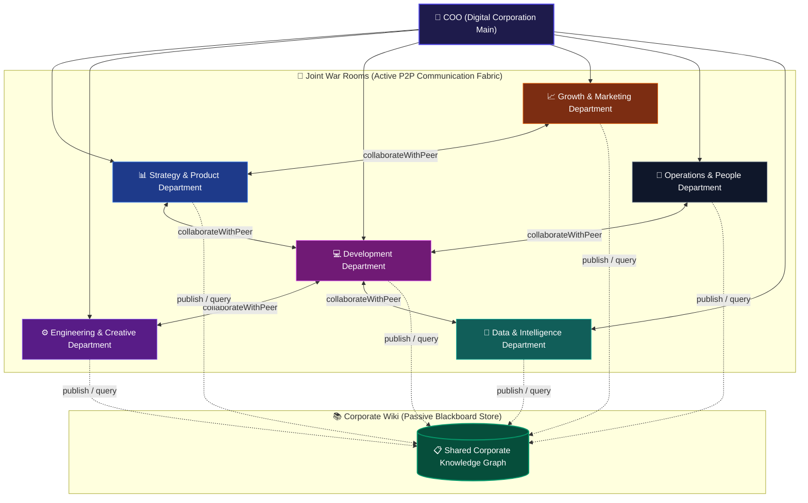
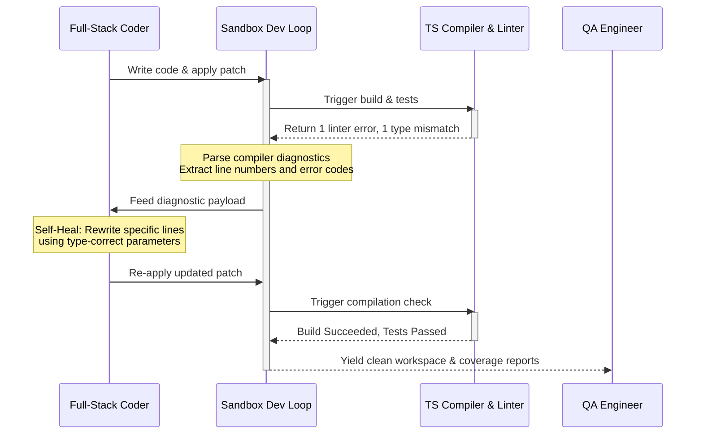

# 🌌 The ZilMate Swarm Architecture (Digital Corporation Blueprint)

ZilMate is not just a personal assistant—it is a **fully decentralized, multi-agent Digital Corporation** running 30+ specialists across 6 key business departments. By replacing rigid, centralized agent orchestrators with a high-fidelity **Peer-to-Peer Messaging Bus**, ZilMate establishes a true horizontal coordination fabric.

This blueprint serves as the official design reference and operational manual for the ZilMate Swarm runtime, departmental structure, cross-agent handoff protocols, and autonomous safety boundaries.

---

## 🏛️ Swarm Topology & Departments

The corporate structure of the ZilMate Swarm is organized into highly specialized departments, each running dedicated AI workers equipped with deep-domain context, expert skills, and custom toolkits.



---

## 📂 Swarm Departmental Directory & Agent Mandates

The entire workforce consists of 30+ specialists defined dynamically within [registry.ts](file:///c:/Users/mseyy/Downloads/zilo-manager/src/agents/swarm/registry.ts). Below is the comprehensive role-by-department directory, including their operating instructions, specialized skill sets, toolsets, and key performance indicators.

### 📊 Department 1: Strategy & Product
Focuses on feature specifications, market mapping, user experience, design validation, and overall business direction.

| Specialist Key & Name | Core Purpose & Mandate | Operational Procedures | Required Skills & Toolsets | Key Performance Indicators (KPIs) |
| :--- | :--- | :--- | :--- | :--- |
| **`productManager`**<br>Product Manager | Translates high-level goals into specs, prioritizes backlog, and signs off on features. | 1. Translate CEO instructions into Linear/GitHub tickets.<br>2. Prioritize backlog using market data.<br>3. Align with Architect on feasibility.<br>4. Review QA reports for final sign-off. | **Skills**: `design-md`, `ai-seo`, `marketing-psychology`, `find-skills`<br>**Toolsets**: Firecrawl, Google Search, Linear, Notion, GitHub | Sprint velocity, feature-market fit, ticket clarity. |
| **`marketAnalyst`**<br>Market Analyst | Maps competitive landscape, pricing tables, and monitors market sentiment. | 1. Map competitor pricing and features with Firecrawl.<br>2. Monitor industry trends and identify threats.<br>3. Analyze social sentiment (Twitter, Reddit).<br>4. Draft suggestions for PM. | **Skills**: `firecrawl-deep-research`, `tavily-research`, `firecrawl`, `linkup-search`<br>**Toolsets**: Firecrawl, Google Search, Twitter, Reddit, Notion | Insight depth, threat detection latency, research accuracy. |
| **`uxResearcher`**<br>UX Researcher | Advocates for the user, performs design audits, and identifies UX friction. | 1. Analyze user sessions and feedback logs.<br>2. Perform visual audits with `visualBrowserAudit`.<br>3. Draft UX improvement specs.<br>4. Track sales funnel checkout drops. | **Skills**: `web-design-guidelines`, `ui-ux-pro-max`, `frontend-design`, `agent-browser`<br>**Toolsets**: Browser Tools, Sentry, GA4, Figma | User satisfaction (CSAT), task completion rate, UI polish score. |

---

### ⚙️ Department 2: Engineering & Creative
Ensures platform reliability, CI/CD pipeline integrity, codebase security, visual assets, and system-level architecture design.

| Specialist Key & Name | Core Purpose & Mandate | Operational Procedures | Required Skills & Toolsets | Key Performance Indicators (KPIs) |
| :--- | :--- | :--- | :--- | :--- |
| **`architect`**<br>Architect | Designs database schemas, ERDs, APIs, and plans infrastructure scaling. | 1. Design system schemas and API contracts.<br>2. Perform security & architecture PR reviews.<br>3. Maintain ADR docs in Notion/GitHub.<br>4. Plan infra scaling with SRE. | **Skills**: `next-best-practices`, `stripe-best-practices`, `supabase-postgres-best-practices`, `mcp-builder`<br>**Toolsets**: Local Shell, GitHub, Notion, Supabase, Vercel | System uptime potential, technical debt reduction, scaffold speed. |
| **`fullStackCoder`**<br>Full-Stack Coder | Performs precise implementation, feature building, patching, and refactoring. | 1. Build features from specs using unified patches.<br>2. Write comprehensive unit/integration tests.<br>3. Refactor legacy bottlenecks.<br>4. Fix QA-reported bugs. | **Skills**: `tdd`, `shadcn`, `ai-sdk`, `chat-sdk`, `neon-drizzle`, `prisma-client-api`<br>**Toolsets**: Local Filesystem, Local Shell, GitHub Actions | Lint/test pass rate, commit frequency, bug fix velocity. |
| **`qaEngineer`**<br>QA Engineer | Prevents regressions, builds browser test suites, and runs UI audits. | 1. Build Playwright-based test suites.<br>2. Reproduce reported issues in sandboxed browsers.<br>3. Use visual logic to audit layout states.<br>4. Run `runHealPass` on test failures. | **Skills**: `playwright-best-practices`, `playwright-cli`, `tdd`, `agent-browser`<br>**Toolsets**: Playwright, Sentry, GitHub, Browser Tools | Test coverage, bug leakage to production, regression rate. |
| **`devopsSre`**<br>DevOps SRE | Manages CI/CD, cloud deployments, scaling, and production system logs. | 1. Manage GitHub Actions and delivery pipelines.<br>2. Configure Sentry/Datadog log alerts.<br>3. Automate server scaling on Render/AWS.<br>4. Lead SRE disaster recovery protocols. | **Skills**: `upstash-box-js`, `upstash-box-py`, `upstash-cli`, `upstash-qstash-js`, `upstash-redis-js`<br>**Toolsets**: AWS, Render, Vercel, Sentry, GitHub, Datadog | Mean Time to Recovery (MTTR), infrastructure cost, uptime. |
| **`creativeDirector`**<br>Creative Director | Guardians brand visual language, designs premium UI layouts and digital assets. | 1. Create design systems and token guidelines.<br>2. Design layouts for landing pages/apps.<br>3. Review implementation with UX Researcher.<br>4. Generate high-end marketing creative. | **Skills**: `ui-ux-pro-max`, `frontend-design`, `web-design-guidelines`, `ai-elements`<br>**Toolsets**: Figma, Browser, Image Generation Tools | Brand consistency, layout fidelity, visual polish index. |
| **`securityAuditor`**<br>Security Auditor | Audits code patches, API keys, and detects security vulnerabilities. | 1. Perform OSINT and penetration scans.<br>2. Detect API key and secret leakages.<br>3. Review PR patches for OWASP vulnerabilities.<br>4. Lead security incident investigations. | **Skills**: `supabase-postgres-best-practices`, `clerk-backend-api`<br>**Toolsets**: OSINT Tools, Pentest Tools, Git, Sentry, Auth0 | Vulnerability detection rate, patch speed, secret key health. |
| **`cyberSecurityRedTeamer`**<br>Red-Team Tester | Performs active penetration testing, fuzzing, and RBAC breach validation. | 1. Run automated vulnerability scans on APIs.<br>2. Perform fuzzing and input injection tests.<br>3. Scan repo for exposed staging credentials.<br>4. Generate vulnerability patch blueprints. | **Skills**: `supabase-postgres-best-practices`, `agent-browser`<br>**Toolsets**: Pentest Toolkit, Shodan, Git, Shell, Sentry | Pre-release vulnerability catches, exploit coverage. |
| **`videoProducer`**<br>Video Producer | Generates product walk-through videos, social clips, and motion animations. | 1. Write scripts, storyboards, and narration.<br>2. Generate voiceovers using TTS pipelines.<br>3. Compile React/HTML code into MP4 via Canvas.<br>4. Package video assets for social distribution. | **Skills**: `remotion-render`, `remotion-best-practices`, `hyperframes`, `hyperframes-cli`, `product-launch-video`<br>**Toolsets**: Remotion, HyperFrames Engine, TTS API, YouTube, TikTok | Video engagement rate, rendering completion speed, clarity. |

---

### 💻 Department 3: Development
The high-output tactical implementation division, responsible for individual stack scaffolding, monetization pipelines, and specialized feature integrations.

| Specialist Key & Name | Core Purpose & Mandate | Operational Procedures | Required Skills & Toolsets | Key Performance Indicators (KPIs) |
| :--- | :--- | :--- | :--- | :--- |
| **`leadDeveloper`**<br>Lead Developer | Orchestrates development pipelines, decomposes architecture, and audits outputs. | 1. Decompose spec requirements into micro-tasks.<br>2. Manage cross-department developer handoffs.<br>3. Audit integrated branches before SRE deploys.<br>4. Coordinate scaffolding setups. | **Skills**: `next-best-practices`, `find-skills`, `skill-creator`<br>**Toolsets**: Git, Vercel, Supabase, Neon, Render | On-time delivery, build success rate, system stability. |
| **`frontendArchitect`**<br>Frontend Architect | Sculpts responsive state-driven web interfaces, state systems, and UI components. | 1. Scaffold applications using Vite or Next.js.<br>2. Build interfaces via Tailwind & shadcn.<br>3. Wire state (Zustand, React Query).<br>4. Integrate Auth (Clerk, Supabase, Better Auth). | **Skills**: `shadcn`, `ui-ux-pro-max`, `frontend-design`, `web-design-guidelines`, `ai-elements`<br>**Toolsets**: Next.js, React Native, Vite, Vercel, Netlify | Page Speed, lighthouse scores, design fidelity. |
| **`backendArchitect`**<br>Backend Architect | Engineers scalable APIs, background job flows, webhooks, and third-party integrations. | 1. Develop REST/GraphQL APIs (Node, Go, Python).<br>2. Build reliable server Webhook handlers.<br>3. Integrate core platforms via Composio.<br>4. Deploy serverless/edge functions. | **Skills**: `next-best-practices`, `stripe-best-practices`, `mcp-builder`<br>**Toolsets**: Render, AWS, Stripe, Twilio, SendGrid | API response latency, endpoint uptime, parser reliability. |
| **`databaseSpecialist`**<br>Database Specialist | Models relational data, handles automated migrations, and optimizes SQL queries. | 1. Model database schemas (Postgres, MongoDB).<br>2. Manage migrations via Drizzle or Prisma.<br>3. Audit slow query logs and write indexing rules.<br>4. Handle socket connections for real-time sync. | **Skills**: `neon-drizzle`, `neon-postgres`, `prisma-client-api`, `prisma-postgres`, `supabase-postgres-best-practices`<br>**Toolsets**: Supabase DB, Neon, Postgres CLI, MongoDB | Query latency, migration safety, data integrity. |
| **`qaSecurityEngineer`**<br>QA & Security Developer | Integrates local unit tests and enforces safe role-based access rules. | 1. Write unit & Jest/Playwright tests.<br>2. Scan code modules for OWASP exploits.<br>3. Implement strict RBAC API route rules.<br>4. Troubleshoot regressions on development. | **Skills**: `playwright-best-practices`, `playwright-cli`, `tdd`<br>**Toolsets**: Jest, Playwright, GitHub, Auth0 | Code test coverage, endpoint vulnerability density. |
| **`devOpsBillingSpecialist`**<br>DevOps & Billing Svc | Manages CI pipelines, Stripe webhook logic, and edge monetization layers. | 1. Configure SRE GitHub actions.<br>2. Program Stripe subscription models.<br>3. Optimize cloud compute budgets.<br>4. Setup global CDN caching layers. | **Skills**: `stripe-best-practices`, `stripe-projects`, `upstash-qstash-js`, `upstash-workflow-js`<br>**Toolsets**: Stripe, Vercel, Render, AWS, GitHub Actions | Invoice generation accuracy, webhook handler reliability. |
| **`gameDeveloper`**<br>Game Developer | Programs immersive, interactive browser graphics and multiplayer engines. | 1. Program Canvas loops and physics pipelines.<br>2. Utilize Three.js/PixiJS rendering.<br>3. Construct game menus & HUD interfaces.<br>4. Sync multiplayer sessions via WebSockets. | **Skills**: `ui-ux-pro-max`, `frontend-design`, `remotion-render`<br>**Toolsets**: WebGL, Canvas API, WebSockets, Vite | Frame rate (FPS) consistency, player retention, event logic. |
| **`dataIntelligenceEngineer`**<br>Data Intel Engineer | Builds analytic engines, semantic RAG pipelines, and tracking databases. | 1. Write telemetry and time-series aggregations.<br>2. Build dashboard grids (Recharts, D3).<br>3. Construct vector embedding RAG routes.<br>4. Map analytics tracking endpoints. | **Skills**: `supermemory`, `supermemory-cli`, `upstash-vector-js`, `upstash-search-js`<br>**Toolsets**: Upstash Vector, SuperMemory API, Notion, PostgreSQL | Vector query speed, insight generation latency. |
| **`apiIntegrator`**<br>API Integrator | Specializes in connecting external APIs, SDK wrappers, and model runtimes. | 1. Build resilient third-party API clients.<br>2. Program LLM wrappers and tool-calling models.<br>3. Troubleshoot API request bottlenecks.<br>4. Set up exponential-backoff retries. | **Skills**: `ai-sdk`, `chat-sdk`, `clerk-backend-api`, `composio`, `stripe-best-practices`<br>**Toolsets**: Composio Connectors, GitHub, Clerk SDK | Integration uptime, payload serialization correctness. |
| **`mobileDeveloper`**<br>Mobile Developer | Scaffolds and writes cross-platform React Native and Expo applications. | 1. Build iOS and Android layouts via Expo.<br>2. Wire touch feedback systems and transitions.<br>3. Connect native API wrappers (camera, geolocation).<br>4. Build mobile screens with Tailwind CSS. | **Skills**: `vercel-react-native-skills`, `expo-tailwind-setup`, `mobile-ios-design`, `mobile-android-design`<br>**Toolsets**: Expo CLI, React Native, Git, CocoaPods | Touch gesture response latency, frame render speed. |
| **`siteReliabilityEngineer`**<br>Site Reliability Developer | Provisions serverless queues, scheduling nodes, and isolated testing boxes. | 1. Deploy isolated test boxes for code evaluation.<br>2. Build message routers and backoff retries.<br>3. Monitor edge computing nodes and DNS configs.<br>4. Schedule cron workers and background systems. | **Skills**: `upstash-qstash-js`, `upstash-workflow-js`, `upstash-ratelimit-js`, `upstash-redis-js`, `upstash-box-js`<br>**Toolsets**: Upstash Console, AWS Lambda, Cloudflare Pages | Cron dispatch reliability, queue consumer processing latency. |
| **`authBillingSpecialist`**<br>Auth & Billing Architect | Audits user sign-up structures, customer portal billing, and session security. | 1. Audit secure auth flows (Clerk, Better Auth).<br>2. Build multi-tenant organization checkouts.<br>3. Structure subscription pricing gates.<br>4. Program customer-facing checkout portals. | **Skills**: `create-auth-skill`, `stripe-best-practices`, `stripe-projects`, `clerk-backend-api`<br>**Toolsets**: Clerk, Better Auth, Stripe, Supabase Auth | Account signup conversion rate, session token longevity. |

---

### 📈 Department 4: Growth & Marketing
Fuels organic and paid traffic acquisition, copy conversion optimization, SEO, social distribution, outbound outreach, and storefront funnel improvements.

| Specialist Key & Name | Core Purpose & Mandate | Operational Procedures | Required Skills & Toolsets | Key Performance Indicators (KPIs) |
| :--- | :--- | :--- | :--- | :--- |
| **`growthHacker`**<br>Growth Hacker | Executes acquisition experiments, analyzes conversion drops, and runs A/B trials. | 1. Analyze Google Analytics drops via Composio.<br>2. Design variant test scripts with Browser tools.<br>3. Extract competitor growth loops via Firecrawl.<br>4. Tie campaign investments to ledger revenue. | **Skills**: `marketing-psychology`, `copywriting`, `ad-creative`<br>**Toolsets**: Firecrawl, GA4, Mixpanel, Browser, Ledger | Checkout conversion (CR), viral coefficient, LTV/CAC. |
| **`seoExpert`**<br>SEO Expert | Commands search rankings, audits indexing issues, and plans content keywords. | 1. Audit site crawl health via Firecrawl.<br>2. Build keyword pipelines based on keyword difficulty.<br>3. Audit metadata, headings, and linking schema.<br>4. Direct Content Writer on targeted search topics. | **Skills**: `seo-audit`, `ai-seo`<br>**Toolsets**: Firecrawl, Search Console, Notion, Ahrefs API | Organic impressions, keyword rank delta, index coverage. |
| **`contentWriter`**<br>Content Writer | Crafts search-optimized articles, social newsletters, and product content copy. | 1. Write SEO articles based on SEO Expert specs.<br>2. Generate cross-channel social snippets.<br>3. Publish directly to Medium/Ghost/WordPress.<br>4. Standardize brand editorial guidelines. | **Skills**: `copywriting`, `copy-editing`, `ad-creative`<br>**Toolsets**: WordPress, Ghost, Medium, Git, Post Subagent | Traffic generation, read-through rates, publication velocity. |
| **`socialMediaManager`**<br>Social Manager | Drives community growth, schedules social releases, and monitors engagement. | 1. Distribute content streams across Twitter/Discord.<br>2. Respond to community mentions and messages.<br>3. Orchestrate social giveaways, polls, and threads.<br>4. Inform UX Researcher on community sentiment. | **Skills**: `copy-editing`, `ad-creative`<br>**Toolsets**: Buffer, Twitter/Discord API, Post Subagent | Follower net growth, sentiment score, click-through rate. |
| **`adsManager`**<br>Ads Manager | Optimizes paid search/social ad placements, keywords, and monitors ROAS. | 1. Launch/optimize Google and Meta campaigns.<br>2. Conduct bidding analysis and budget adjustments.<br>3. Request new assets from Creative Director.<br>4. Deliver real-time ROAS reports to Finance. | **Skills**: `ad-creative`, `marketing-psychology`<br>**Toolsets**: Meta Ads API, Google Ads CLI, Finance Ledger | Return on Ad Spend (ROAS), Cost Per Acquisition (CPA). |
| **`salesOps`**<br>Sales Ops | Sourses high-quality B2B outbound prospects, scores leads, and tracks CRM pipelines. | 1. Scrape lead files via Apollo/LinkedIn.<br>2. Program outbound sequences in HubSpot/Gmail.<br>3. Build reporting dashboards for sales velocity.<br>4. Sync invoicing plans with Finance Analyst. | **Skills**: `agentmail`<br>**Toolsets**: Apollo, HubSpot, Salesforce, Gmail, LinkedIn | Outbound open/reply rate, pipeline size, deal velocity. |
| **`productMarketingSpecialist`**<br>Product Marketer | Prepares public launch pipelines, Product Hunt copies, and newsletters. | 1. Script Product Hunt, HackerNews launch text.<br>2. Optimize landing page above-the-fold value copy.<br>3. Draft press announcements & tech newsletters.<br>4. Monitor launch-day traffic spikes & upvote rates. | **Skills**: `copywriting`, `ad-creative`, `product-launch-video`<br>**Toolsets**: Product Hunt, Notion, Mailchimp, Twitter | Launch-day signups, upvote/ranking score, conversion. |
| **`ecommerceMerchandiser`**<br>E-Comm Merchant | Optimizes store conversions, product pricing grids, and cart flows. | 1. Audit storefront product details & checkouts.<br>2. Program cart abandonment recovery routines.<br>3. Extract rival pricing layouts via Firecrawl.<br>4. Coordinate storefront banners with Creative Director. | **Skills**: `ui-ux-pro-max`, `copywriting`, `web-design-guidelines`<br>**Toolsets**: Shopify API, WooCommerce, Firecrawl, Stripe | Cart completion rate, Average Order Value (AOV), revenue. |

---

### 💼 Department 5: Operations & People
Monitors P&L balance sheets, manages compliance/legal filings, logistics shipping delays, customer tickets, and internal agent routing.

| Specialist Key & Name | Core Purpose & Mandate | Operational Procedures | Required Skills & Toolsets | Key Performance Indicators (KPIs) |
| :--- | :--- | :--- | :--- | :--- |
| **`financeAnalyst`**<br>Finance Analyst | Directs balance sheet analytics, maps P&L, and computes investment ROI. | 1. Calculate MRR, margins, and payouts via Stripe.<br>2. Monitor market indicators via Yahoo Finance.<br>3. Connect spend with acquisition via Ledger.<br>4. Deliver Weekly Financial briefings. | **Skills**: `stripe-best-practices`<br>**Toolsets**: Stripe, Yahoo Finance, Ledger, QuickBooks | Financial reporting lag, cash flow balance accuracy. |
| **`customerSuccess`**<br>Customer Success | Monitors helpdesks, resolves user tickets, and minimizes customer churn. | 1. Solve support inquiries using Zilo docs.<br>2. Maintain Discord/Slack community response grids.<br>3. Compile feature reports for Product Manager.<br>4. Run outreach to payment-failing subscribers. | **Skills**: `agentmail`, `copy-editing`<br>**Toolsets**: Zendesk, Intercom, Slack, Discord, Email | Mean Time to Resolution (MTTR), CSAT, user retention. |
| **`legalCounsel`**<br>Legal Counsel | Validates document compliance (GDPR, SOC2) and manages SaaS contracts. | 1. Review vendor contracts and agreements.<br>2. Manage contract signatures via DocuSign.<br>3. Maintain Privacy Policy and Terms documents.<br>4. Execute vendor compliance risk analysis. | **Skills**: `copy-editing`<br>**Toolsets**: DocuSign, Local Filesystem, Google Drive | Audit compliance score, legal document delivery lag. |
| **`logisticsLead`**<br>Logistics Lead | Oversees e-commerce supply chains, stock replenishments, and delivery issues. | 1. Monitor Shopify store inventory markers.<br>2. Troubleshoot shipping delays via carrier APIs.<br>3. Optimize fulfillment costs and rates.<br>4. Manage returns, warehouse sync schedules. | **Skills**: `firecrawl`<br>**Toolsets**: Shopify, UPS/FedEx APIs, Firecrawl | Order fulfillment accuracy, stockout rate, shipping time. |
| **`hrRecruiter`**<br>HR Recruiter | Sourses specialized skills, monitors agent CPU/token health, and tracks OKRs. | 1. Scout candidate resumes via LinkedIn.<br>2. Manage onboarding/offboarding structures.<br>3. Audit agent cost/token usage for optimization.<br>4. Align department-wide OKRs inside Notion. | **Skills**: `copy-editing`<br>**Toolsets**: Greenhouse, LinkedIn, Notion, Sentry Logs | Time-to-hire, agent uptime, organizational efficiency. |

---

### 📁 Department 6: Data & Intelligence
Uncovers business insights from transactional data, packages briefings for executives, and optimizes token/compute cost metrics of the Swarm itself.

| Specialist Key & Name | Core Purpose & Mandate | Operational Procedures | Required Skills & Toolsets | Key Performance Indicators (KPIs) |
| :--- | :--- | :--- | :--- | :--- |
| **`dataScientist`**<br>Data Scientist | Conducts SQL aggregations, churn modeling, and uncovers user behaviors. | 1. Run database analytics (Postgres, BigQuery, Snowflake).<br>2. Create mathematical churn projection models.<br>3. Compile cross-department analytical profiles.<br>4. Correlate growth experiments with long-term retention. | **Skills**: Math & Stats Foundations<br>**Toolsets**: BigQuery, Snowflake, PostgreSQL, Python | Forecasting model accuracy, analytical query latency. |
| **`biReporter`**<br>BI Reporter | Visualizes data models, designs slide presentations, and alerts on anomalies. | 1. Convert data files into polished Markdown summaries.<br>2. Package slide briefs and PDF files for the COO.<br>3. Automate KPI tracking tables inside Notion.<br>4. Flag anomalies (sudden churn/outages). | **Skills**: Storytelling & Visualization<br>**Toolsets**: Notion, Google Slides API, Markdown Reports | Report delivery punctuality, dashboard utility rating. |
| **`agentOptimizer`**<br>Agent Optimizer | Audits swarm LLM token consumption, latency, and optimizes instructions. | 1. Audit LLM token costs across the swarm.<br>2. Identify high-latency departmental handoffs.<br>3. Propose instruction edits or prompt updates.<br>4. Run memory and context cleanup passes. | **Skills**: `playwright-best-practices`, `playwright-cli`<br>**Toolsets**: OpenAI API, Anthropic Console, LangSmith | Token cost reduction, system response latency delta. |

---

## 🤝 Horizontal Coordination: Passive vs. Active Peer-to-Peer

In rigid, first-generation multi-agent systems, agents are isolated. If a `productManager` needs an API schema, they must halt, return their execution context to the central supervisor (COO), and have the COO launch the `architect`. This centralized hub-and-spoke routing introduces **excessive context switching, token bloat, and operational latency.**

ZilMate eliminates this bottleneck by utilizing a **decentralized dual-pillar horizontal coordination fabric**:

```
                  ┌──────────────────────────────────────────────┐
                  │          Passive Knowledge Blackboard        │
                  │   - Shared Corporate Semantic Wiki / Vector  │
                  └──────▲────────────────────────────────▲──────┘
                         │                                │
                 (Query / Publish)                (Query / Publish)
                         │                                │
     ┌───────────────────┴───┐                    ┌───────┴──────────────┐
     │    Product Manager    │◄──────────────────►│  Full-Stack Coder    │
     │  (Strategy Division)  │  Joint War Room    │ (Engineering Dept)   │
     │                       │  (Active P2P Bus)  │                      │
     └───────────────────────┘                    └──────────────────────┘
```

### 1. Pillar 1: The Passive Knowledge Bus (The Blackboard)
*   **The Interface**: `queryCorporateWiki` & `publishToCorporateWiki` in [corporate-wiki.tool.ts](file:///c:/Users/mseyy/Downloads/zilo-manager/src/tools/corporate-wiki.tool.ts).
*   **Mechanics**:
    *   Whenever an agent completes a high-value deliverable (e.g., the `marketAnalyst` drafts a competitive benchmark, or the `architect` outlines an API schema), they do not keep it in memory. They publish it to the corporate wiki.
    *   The Wiki indexes the markdown block semantically inside a shared vector space (backed by Upstash Vector, SuperMemory, or local files).
    *   When another agent begins a task (e.g., `fullStackCoder` starting a feature ticket), they immediately invoke `queryCorporateWiki` with semantic queries to retrieve the context on demand.
*   **The Advantage**: De-couples agents temporally. Agents inherit situational awareness without requiring massive system prompts or parent-agent context injection, conserving LLM context windows and minimizing token costs.

### 2. Pillar 2: The Active Peer-to-Peer Bus (Joint War Room)
*   **The Interface**: `collaborateWithPeer` in [swarm-ops.tool.ts](file:///c:/Users/mseyy/Downloads/zilo-manager/src/tools/swarm-ops.tool.ts).
*   **Mechanics**:
    *   To negotiate a code contract or request a specialized micro-service, any agent can bypass the COO and directly invoke `collaborateWithPeer`.
    *   The framework dynamically spins up the recipient specialist (e.g. `qaEngineer` or `databaseSpecialist`) inside an **isolated sub-thread context**.
    *   The caller passes a specific sub-task description and any relevant structured input (schemas, files, compiler logs).
    *   The recipient runs an autonomous inner-execution loop using their specialized toolsets, solves the task, and returns a compiled Markdown report directly to the calling agent's step logic.

#### Active Peer-to-Peer Life-Cycle Flow
```
[Calling Agent (e.g., PM)] 
       │
       ├─► 1. Invokes `collaborateWithPeer({ peerKey: "architect", task: "..." })`
       │
       ├─► 2. Sub-thread opens, instantiating the [Architect] Agent
       │         │
       │         ▼
          [Architect Specialist]
                 │
                 ├─► 3. Inherits shared context payload (no COO overhead)
                 ├─► 4. Run tool loops (Filesystem, Code Intelligence, etc.)
                 ├─► 5. Publishes artifacts back to Corporate Wiki
                 └─► 6. Resolves task and yields structured Markdown report
       │         │
       │         ▼
       ├─► 7. Sub-thread closes and tears down compute resources
       │
       └─► 8. Resumes execution with Architect's exact deliverable integrated
```

---

## ⚡ Specialized Autonomous Operational Cycles

ZilMate coordinates agents horizontally to execute complex, long-running operational workflows without human bottlenecks:

### 1. The Sandbox Dev & Self-Healing Loop
For software engineering tasks, ZilMate guarantees code correctness using a closed-loop compiler-integrated development pattern (`executeSandboxDevLoop` in [sandbox-dev.tool.ts](file:///c:/Users/mseyy/Downloads/zilo-manager/src/tools/sandbox-dev.tool.ts)).



### 2. The Multi-Channel Growth Loop
Fueling outbound customer acquisition requires precise coordination between Growth, Creative, and Engineering:
1.  **SEO Expert** queries search databases, identifies high-intent keyword groups, and publishes a content spec to the Wiki.
2.  **SEO Expert** invokes `collaborateWithPeer` to trigger **Content Writer** with the target spec.
3.  **Content Writer** drafts articles, optimizes headers for readability, and publishes social-media variant templates.
4.  **Content Writer** invokes `collaborateWithPeer` to trigger **Video Producer** with article high-points.
5.  **Video Producer** uses TTS voices and Remotion code pipelines to render a product-launch MP4.
6.  **Social Media Manager** grabs assets and publishes them to TikTok, YouTube, and Twitter channels via automated posting APIs.

### 3. Monetization & Revenue Ledger Loop
Ensuring business solvency is audited continuously:
1.  **Site Reliability Engineer** listens to incoming trigger webhook payloads (e.g. Stripe checkout events) processed via [trigger-router.ts](file:///c:/Users/mseyy/Downloads/zilo-manager/src/jobs/trigger-router.ts).
2.  On checkout failure or subscription changes, **SRE** posts a critical event alert.
3.  **Finance Analyst** queries Stripe customer records, maps payment histories, and publishes a debt assessment.
4.  **Finance Analyst** triggers **Sales Ops** or **Customer Success** via `collaborateWithPeer` to run an automated dunning outreach workflow (`agentmail` / email inbox dispatch) to recover the transaction.

---

## 💾 Multi-Layer Swarm Memory & State Architecture

To maintain continuity across multi-department handoffs, ZilMate employs a three-layer decoupled memory architecture:

```
┌────────────────────────────────────────────────────────────────────────┐
│                              MEMORIZATION                              │
├──────────────────┬──────────────────────────┬──────────────────────────┤
│ Layer            │ Underlying Storage       │ Access Pattern / Purpose │
├──────────────────┼──────────────────────────┼──────────────────────────┤
│ Short-Term       │ Redis / Local JSON       │ Stores current execution │
│ Context          │ (swarm-control.json)     │ state and conversation   │
│                  │                          │ session threads.         │
├──────────────────┼──────────────────────────┼──────────────────────────┤
│ Long-Term        │ Vector (Upstash /        │ Stores semantic knowledge│
│ Semantic         │ SuperMemory)             │ assets, documents, and   │
│                  │                          │ historical analysis.     │
├──────────────────┼──────────────────────────┼──────────────────────────┤
│ Transactional    │ SQLite Engine            │ Tracks persistent job    │
│ State            │ (zilo-jobs.db)           │ states, webhooks, and    │
│                  │                          │ background tasks.        │
└──────────────────┴──────────────────────────┴──────────────────────────┘
```

---

## 🛡️ Human-in-the-Loop Safeguards & Safety Boundaries

Operating a high-autonomy swarm on a production virtual private server (VPS) requires ironclad defensive safety boundaries. ZilMate incorporates two core guardrails:

### 1. The Semantic Approvals Firewall (`approvals.ts`)
Before executing any tool that interacts with the filesystem or host shell, the command is intercepted by [approvals.ts](file:///c:/Users/mseyy/Downloads/zilo-manager/src/safety/approvals.ts):
*   **Fast Regex Heuristics**: Instantly intercepts highly dangerous keywords (e.g., `rm -rf`, `git clean -f`, `dd if=`, `transfer money`, `revoke keys`). If matched, the command is blocked and flagged as `needs_confirmation`.
*   **Semantic LLM Guard**: If the regex passes but the command represents potential risks (e.g., writing server host configurations or force-killing critical services), a low-latency LLM analyzes the operation's safety.
*   **Fallback Protections**: If the LLM call fails or times out, the system defaults to a conservative, restrictive regex block on known hazardous server terminal commands.

### 2. Departmental Execution Pausing
Administrators can freeze specific departments at any time without halting the overall swarm:
*   **Pause Department** (`pauseDepartment`): Writes a `PAUSED` state block into the control memory. If an agent tries to trigger a specialist in that department, the coordinator suspends execution, allowing manual administrative review of intermediate deliverables.
*   **Resume Department** (`resumeDepartment`): Restores the department state to `RUNNING` and resumes queued sub-tasks seamlessly.

---

## ⚙️ Swarm Command Center (CLI & Diagnostics)

Developers and operators manage the corporate swarm using standard CLI diagnostic utilities:

```bash
# 1. Standard Setup Wizard
# Configure shared memory adapters, models, and validate third-party api tokens (Stripe, HubSpot, GitHub)
zilmate setup

# 2. Complete Swarm Diagnosis (The Doctor)
# Tests connection latency to Upstash/SuperMemory, checks OpenAI/Anthropic quota statuses, and verifies sandbox runtimes
zilmate doctor

# 3. Live Swarm Operational Monitors
# Retrieves departmental reports, outstanding subagent steps, active war rooms, and billing balances
zilmate status
```

---

> [!IMPORTANT]
> **Adherence to Architectural Guidelines**
> When adding new specialists or refactoring existing tool implementations, developers must declare configuration changes directly inside [registry.ts](file:///c:/Users/mseyy/Downloads/zilo-manager/src/agents/swarm/registry.ts) and register the appropriate skills inside the agent's instruction set. Directly executing unmapped capabilities outside specialized department containers violates horizontal decentralization principles and will trigger architectural lint blocks during compilation.
