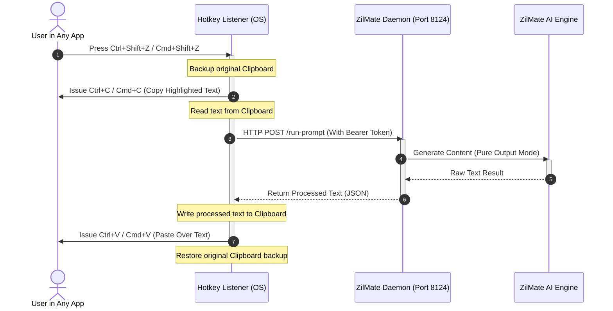

# ZilMate Ubiquity — System-Wide AI Prompt Interception & Injection 🌐

ZilMate Ubiquity is a high-leverage, zero-dependency background daemon service that brings the power of ZilMate directly into any textbox across your operating system. Whether you are typing in **WhatsApp, Notion, VS Code, Slack, or any web browser**, you can instantly query ZilMate, process your text, and replace it in-place using a single global keyboard shortcut.

---

## 🚀 Key Features

*   **Global Hotkey Integration**: Trigger instant AI processing using `Ctrl + Shift + Z` (on Windows) or `Cmd + Shift + Z` (on macOS).
*   **Pristine Clipboard Restoration**: Intercepts active selection, processes it via the AI engine, replaces it in-place, and seamlessly restores your original clipboard contents so you never lose your copy buffer.
*   **Pure Output Mode**: Intercepted prompts are processed with dedicated system instructions that suppress all conversational preamble (e.g., *"Sure, here is your text..."*), rendering only the direct, raw result.
*   **Zero-Dependency Native Architecture**: No bulky Electron apps, native C++ wrappers, or separate compiled binaries. Uses lightweight, scriptable OS hooks.
*   **Pragmatic Local Security**: Communication with the background daemon is locked down using rotating, single-use security tokens.

---

## 🏛️ System Architecture

ZilMate Ubiquity operates as a lightweight client-server architecture running entirely on your local machine:



### 1. The Local Daemon (`src/daemon/service.ts`)
The core background daemon listens locally on port `8124` (or configured via `ZILMATE_DAEMON_PORT`). 
*   It exposes a secure `/run-prompt` endpoint.
*   It handles system-level coordination and safely communicates with ZilMate’s central multi-agent router.

### 2. Windows Keyboard Listener (`src/daemon/win-listener.ps1`)
On Windows, a scriptable background worker runs in PowerShell:
*   Compiles a WinForms-based raw keyboard hook on-the-fly using `Add-Type`.
*   Registers a global hook for `Ctrl + Shift + Z`.
*   Operates a standard Windows message loop to listen for keyboard events without polling or burning CPU cycles.

### 3. macOS Native Service Installer (`src/daemon/mac-installer.ts`)
On macOS, system-wide shortcuts are restricted. ZilMate overcomes this programmatically:
*   Generates a native **macOS Quick Action Service** at `~/Library/Services/ZilMate Ubiquity.workflow/`.
*   Specifies service parameters using custom Property Lists (`Info.plist` and `document.wflow`).
*   Runs a native background shell script that fetches the security token and triggers the local daemon.
*   Parses responses zero-dependency using **JavaScript for Automation (JXA)** (`osascript -l JavaScript`).
*   Programmatically maps and registers the `Cmd + Shift + Z` (`@$z`) keyboard shortcut into the system services database (`~/Library/Preferences/pbs.plist`).

---

## 🛡️ Secure Authorization Model

To prevent unauthorized cross-origin requests (CSRF, DNS rebinding, or malicious web scripts executing prompts on your local daemon), ZilMate implements a secure, single-use token pipeline:

1.  **Token Generation**: On startup, the daemon generates a cryptographically secure token and writes it to your user home directory at `~/.zilmate-token` with restricted read-write permissions.
2.  **Authorization Header**: The local hotkey listener reads the token directly from your file system and passes it inside the `Authorization: Bearer <token>` HTTP header.
3.  **Cross-Origin Isolation**: Any requests missing a valid authorization token are rejected immediately with a `401 Unauthorized` status.

---

## 💻 CLI Commands

Control the daemon and manage your keyboard listener directly from the ZilMate CLI:

| Command | Description |
| :--- | :--- |
| `zilmate daemon status` | Inspects the current daemon port, active platform, and hotkey configuration. |
| `zilmate daemon start` | Launches the local HTTP daemon and registers the global hotkey listener. |
| `zilmate daemon stop` | Shuts down the local daemon and terminates the background listener processes. |
| `zilmate daemon install-mac` | Scaffolds the `.workflow` service and registers the system-wide keyboard shortcut on macOS. |

---

## 🛠️ Step-by-Step Execution Lifecycle

When you highlight text in any application (e.g., typing *"write an email apologizing for the delay"* in WhatsApp) and press your hotkey:

1.  **Clipboard Backup**: The hotkey listener backs up your current clipboard text and format.
2.  **Selection Capture**: The listener issues a programmatic `Ctrl + C` (or `Cmd + C`) key event to copy the highlighted text into the clipboard.
3.  **Payload Extraction**: The listener retrieves the copied string, clears the clipboard, and reads the secure token from `~/.zilmate-token`.
4.  **API Resolution**: The listener fires an HTTP POST request containing the prompt payload and the authorization token to `http://127.0.0.1:8124/run-prompt`.
5.  **Agent Processing**: The daemon feeds the prompt to the ZilMate router. It uses system-level constraints ensuring the response is **only the direct answer**, without preambles or chat conversational filler.
6.  **Pasted Injection**: The processed output is returned to the listener, written into the clipboard, and injected back into your active application via a programmatic `Ctrl + V` (or `Cmd + V`) key event.
7.  **Pristine Rollback**: The listener restores your original backed-up clipboard content.

---

## 🔍 Troubleshooting & Diagnostics

If your hotkey does not appear to trigger, run these diagnostic checks:

### 1. Run Doctor
Use ZilMate's built-in diagnosis suite to verify the state of your installation:
```bash
zilmate doctor
```

### 2. Verify Port Accessibility
The daemon requires port `8124` to receive keyboard listener commands. Verify if another service is occupying the port:
```powershell
# On Windows
Get-NetTCPConnection -LocalPort 8124 -ErrorAction SilentlyContinue

# On macOS
lsof -i :8124
```

### 3. Check macOS Accessibility Permissions
On macOS, ensure terminal utilities and shortcuts have permission to send keyboard events:
*   Go to **System Settings > Privacy & Security > Accessibility**.
*   Verify that your terminal or runner of choice is enabled.
*   Ensure that Services are allowed to run system-wide.

### 4. Inspect Active Processes (Windows)
If you suspect the PowerShell listener is hung, you can search for and terminate any runaway listeners:
```powershell
Get-CimInstance Win32_Process -Filter "Name = 'powershell.exe'" | Where-Object { $_.CommandLine -like '*win-listener.ps1*' }
```
*(Or simply run `zilmate daemon stop` to clear it automatically).*
